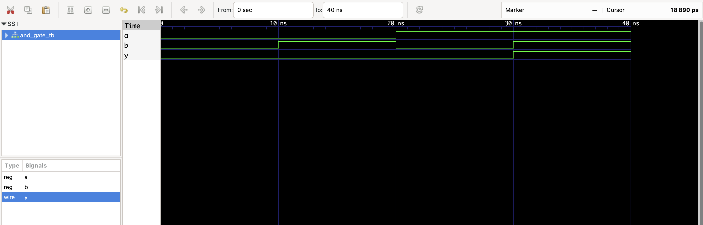

# AND Gate

Simple 2-input AND gate.

## Files
- `and_gate.v`: RTL module
- `and_gate_tb.v`: Testbench
- `and_gate.vcd`: Waveform file (for GTKWave)

## To Simulate
```bash
iverilog -o and_gate_tb.vvp and_gate.v and_gate_tb.v
vvp and_gate_tb.vvp
gtkwave and_gate.vcd

## 📊 Simulation Waveform

Here’s the output from GTKWave:


